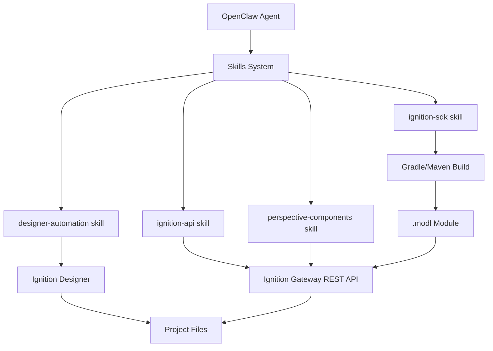

# OpenClaw + Ignition Integration Implementation Plan

## Executive Summary

This plan outlines how to equip an OpenClaw agent with comprehensive capabilities to access, edit, create, deploy, and test Ignition Perspective projects. The implementation leverages OpenClaw’s skills system, computer control, and Gateway protocol.

-----

## Current State Analysis

### ✅ OpenClaw Strengths

- **Computer Control**: Execute bash, Python, Node.js, Java
- **File System Access**: Full CRUD on local files
- **HTTP Client**: Make REST API calls
- **Browser Automation**: Control Chrome/Chromium via CDP
- **Skills Framework**: Modular, extensible tool system
- **Gateway Protocol**: WebSocket-based RPC for tool execution

### ❌ Gaps for Ignition Integration

- No existing skills for Ignition project manipulation
- No Perspective-specific tooling
- No Designer automation
- No direct SDK integration

-----

## Phased Implementation Plan

### Phase 1: Ignition REST API Skill    )

**Priority**: 🔴 Critical  
**Complexity**: 🟢 Low-Medium

Create a skill that wraps the Ignition 8.3 REST API for programmatic gateway interaction.

#### Skill Structure

```
/mnt/skills/user/ignition-api/
├── SKILL.md              # Skill documentation
├── tools/
│   ├── auth.py          # API token management
│   ├── projects.py      # Project CRUD operations
│   ├── resources.py     # View/component resource management
│   ├── tags.py          # Tag provider operations
│   └── modules.py       # Module deployment
└── examples/
    ├── create-project.sh
    ├── export-project.sh
    └── deploy-module.sh
```

#### Core Capabilities

1. **Authentication**
- Store/retrieve API tokens securely
- Generate tokens via Gateway API
- Handle token refresh/expiration
1. **Project Management**
   
   ```bash
   # List projects
   openclaw agent --message "List all Perspective projects"
   
   # Export project
   openclaw agent --message "Export project 'MyHMI' to /tmp/MyHMI.zip"
   
   # Import/create project
   openclaw agent --message "Import project from /tmp/backup.zip"
   
   # Update project resources
   openclaw agent --message "Update the HomePage view in MyHMI project"
   ```
1. **Resource Operations**
- Create/update/delete Perspective views
- Manage named queries, scripts, tags
- Handle binary resources (images, fonts)
1. **Module Management**
- Deploy .modl files
- List installed modules
- Check module status

#### Implementation Code Examples

**SKILL.md**:

```markdown
# Ignition REST API Skill

This skill provides programmatic access to Ignition Gateway via the 8.3+ REST API.

## Prerequisites
- Ignition 8.3+ running on the same system (or accessible via network)
- API token generated in Gateway (System > Security > API Tokens)
- Python 3.8+ with `requests` library

## Configuration
Set environment variables or store in OpenClaw config:
- `IGNITION_GATEWAY_URL`: Gateway URL (default: http://localhost:8088)
- `IGNITION_API_TOKEN`: API authentication token

## Available Operations

### Project Management
- List all projects
- Get project details
- Export project as ZIP
- Import project from ZIP
- Create new project
- Delete project

### Resource Management  
- List resources in a project
- Get resource content (JSON)
- Create/update resources (views, scripts, queries)
- Delete resources

### Tag Operations
- List tag providers
- Read tag values
- Write tag values
- Create/modify tag configurations

### Module Operations
- List installed modules
- Deploy module (.modl file)
- Get module status

## Example Usage

### Create a new Perspective project
```

Agent: Create a new Perspective project called “ProductionDashboard”

```
### Export a project for backup
```

Agent: Export the “ProductionDashboard” project to /backups/prod-$(date +%Y%m%d).zip

```
### Update a view
```

Agent: In the ProductionDashboard project, update the MainView to include a new button component

```

```

**tools/auth.py**:

```python
#!/usr/bin/env python3
"""
Ignition API Authentication Helper
"""
import os
import requests
import json
from pathlib import Path

class IgnitionAuth:
    def __init__(self, gateway_url=None, token=None):
        self.gateway_url = gateway_url or os.getenv('IGNITION_GATEWAY_URL', 'http://localhost:8088')
        self.token = token or os.getenv('IGNITION_API_TOKEN')
        self.headers = {
            'Authorization': f'Bearer {self.token}',
            'Content-Type': 'application/json'
        }
    
    def test_connection(self):
        """Test API connectivity and authentication"""
        try:
            response = requests.get(
                f'{self.gateway_url}/data/perspective/projects',
                headers=self.headers,
                timeout=10
            )
            response.raise_for_status()
            return True, "Connection successful"
        except requests.exceptions.RequestException as e:
            return False, str(e)
    
    def get_projects(self):
        """List all Perspective projects"""
        response = requests.get(
            f'{self.gateway_url}/data/perspective/projects',
            headers=self.headers
        )
        response.raise_for_status()
        return response.json()

if __name__ == '__main__':
    auth = IgnitionAuth()
    success, message = auth.test_connection()
    if success:
        projects = auth.get_projects()
        print(json.dumps(projects, indent=2))
    else:
        print(f"Error: {message}")
```

**tools/projects.py**:

```python
#!/usr/bin/env python3
"""
Ignition Project Management Operations
"""
import requests
import json
from pathlib import Path
from .auth import IgnitionAuth

class ProjectManager:
    def __init__(self):
        self.auth = IgnitionAuth()
    
    def list_projects(self):
        """Get list of all projects"""
        response = requests.get(
            f'{self.auth.gateway_url}/data/perspective/projects',
            headers=self.auth.headers
        )
        response.raise_for_status()
        return response.json()
    
    def get_project(self, project_name):
        """Get detailed project information"""
        response = requests.get(
            f'{self.auth.gateway_url}/data/perspective/projects/{project_name}',
            headers=self.auth.headers
        )
        response.raise_for_status()
        return response.json()
    
    def export_project(self, project_name, output_path):
        """Export project as ZIP"""
        response = requests.get(
            f'{self.auth.gateway_url}/data/perspective/projects/{project_name}/export',
            headers=self.auth.headers,
            stream=True
        )
        response.raise_for_status()
        
        output_file = Path(output_path)
        with open(output_file, 'wb') as f:
            for chunk in response.iter_content(chunk_size=8192):
                f.write(chunk)
        
        return str(output_file.absolute())
    
    def import_project(self, zip_path, project_name=None):
        """Import project from ZIP"""
        files = {'file': open(zip_path, 'rb')}
        params = {}
        if project_name:
            params['projectName'] = project_name
        
        response = requests.post(
            f'{self.auth.gateway_url}/data/perspective/projects/import',
            headers={'Authorization': self.auth.headers['Authorization']},
            files=files,
            params=params
        )
        response.raise_for_status()
        return response.json()
    
    def create_project(self, project_name, title=None, description=None):
        """Create new Perspective project"""
        data = {
            'name': project_name,
            'title': title or project_name,
            'description': description or ''
        }
        
        response = requests.post(
            f'{self.auth.gateway_url}/data/perspective/projects',
            headers=self.auth.headers,
            json=data
        )
        response.raise_for_status()
        return response.json()
    
    def delete_project(self, project_name):
        """Delete a project"""
        response = requests.delete(
            f'{self.auth.gateway_url}/data/perspective/projects/{project_name}',
            headers=self.auth.headers
        )
        response.raise_for_status()
        return True

if __name__ == '__main__':
    import sys
    pm = ProjectManager()
    
    if len(sys.argv) > 1:
        command = sys.argv[1]
        if command == 'list':
            projects = pm.list_projects()
            print(json.dumps(projects, indent=2))
        elif command == 'export' and len(sys.argv) > 3:
            result = pm.export_project(sys.argv[2], sys.argv[3])
            print(f"Exported to: {result}")
        elif command == 'create' and len(sys.argv) > 2:
            result = pm.create_project(sys.argv[2])
            print(json.dumps(result, indent=2))
```

**tools/resources.py**:

```python
#!/usr/bin/env python3
"""
Ignition Project Resource Management
"""
import requests
import json
from .auth import IgnitionAuth

class ResourceManager:
    def __init__(self):
        self.auth = IgnitionAuth()
    
    def list_resources(self, project_name, resource_type=None):
        """List resources in a project
        
        resource_type: 'views', 'scripts', 'queries', 'styles', etc.
        """
        url = f'{self.auth.gateway_url}/data/perspective/projects/{project_name}/resources'
        if resource_type:
            url += f'/{resource_type}'
        
        response = requests.get(url, headers=self.auth.headers)
        response.raise_for_status()
        return response.json()
    
    def get_resource(self, project_name, resource_type, resource_path):
        """Get specific resource content"""
        url = f'{self.auth.gateway_url}/data/perspective/projects/{project_name}/resources/{resource_type}/{resource_path}'
        
        response = requests.get(url, headers=self.auth.headers)
        response.raise_for_status()
        return response.json()
    
    def update_resource(self, project_name, resource_type, resource_path, content):
        """Update or create a resource"""
        url = f'{self.auth.gateway_url}/data/perspective/projects/{project_name}/resources/{resource_type}/{resource_path}'
        
        response = requests.put(
            url,
            headers=self.auth.headers,
            json=content
        )
        response.raise_for_status()
        return response.json()
    
    def delete_resource(self, project_name, resource_type, resource_path):
        """Delete a resource"""
        url = f'{self.auth.gateway_url}/data/perspective/projects/{project_name}/resources/{resource_type}/{resource_path}'
        
        response = requests.delete(url, headers=self.auth.headers)
        response.raise_for_status()
        return True
    
    def get_view(self, project_name, view_path):
        """Get Perspective view JSON"""
        return self.get_resource(project_name, 'views', view_path)
    
    def update_view(self, project_name, view_path, view_json):
        """Update Perspective view"""
        return self.update_resource(project_name, 'views', view_path, view_json)
    
    def create_view(self, project_name, view_path, view_json):
        """Create new Perspective view"""
        return self.update_resource(project_name, 'views', view_path, view_json)
```

-----

### Phase 2: Perspective Component Library Skill   3-4)

**Priority**: 🟡 High  
**Complexity**: 🟡 Medium

Create a skill with knowledge of Perspective component schemas and best practices.

#### Skill Structure

```
/mnt/skills/user/perspective-components/
├── SKILL.md
├── schemas/
│   ├── common-components.json    # Button, Label, TextField, etc.
│   ├── charts.json               # Chart components
│   ├── containers.json           # Flex, Grid, etc.
│   └── custom-components.json    # User-defined components
├── templates/
│   ├── dashboard-template.json
│   ├── alarm-view-template.json
│   └── login-page-template.json
└── generators/
    ├── create_view.py
    ├── add_component.py
    └── bind_tag.py
```

#### Capabilities

- Generate valid Perspective view JSON
- Add components with proper schemas
- Configure property bindings (tags, expressions, scripts)
- Apply styles and themes
- Validate component configurations

#### Example Usage

```bash
# Create a new view with a button
openclaw agent --message "Create a view called 'ControlPanel' with a button that writes to tag 'StartMotor'"

# Add a chart to existing view
openclaw agent --message "Add a time series chart to MainDashboard showing tags 'Temperature' and 'Pressure'"

# Create a complete dashboard
openclaw agent --message "Create a production dashboard with OEE metrics, alarm summary, and trend charts"
```

-----

### Phase 3: Designer Automation Skill   5-6)

**Priority**: 🟡 High  
**Complexity**: 🔴 High

Automate Designer interactions using browser control and file system manipulation.

#### Approaches

**Option A: Browser Automation (Selenium/Playwright)**

- Launch Designer via browser
- Automate UI interactions (drag-drop, property editing)
- Requires reverse-engineering Designer UI
- Pros: Can do anything a human can
- Cons: Brittle, slow, complex

**Option B: File System Manipulation**

- Directly edit project files in `projects/` directory
- Bypass Designer entirely for some operations
- Requires understanding of file formats
- Pros: Fast, reliable, scriptable
- Cons: Must restart Designer/gateway to see changes

**Recommended: Hybrid Approach**
Use API (Phase 1) for most operations, file system for complex/bulk operations.

-----

### Phase 4: SDK Module Development Skill   7-8)

**Priority**: 🟢 Medium  
**Complexity**: 🔴 High

Enable creation and building of custom Ignition modules.

#### Skill Structure

```
/mnt/skills/user/ignition-sdk/
├── SKILL.md
├── templates/
│   ├── gradle-module-template/
│   ├── maven-module-template/
│   └── perspective-component-template/
├── builders/
│   ├── build_module.sh
│   ├── deploy_module.py
│   └── test_module.sh
└── generators/
    ├── scaffold_perspective_component.py
    ├── scaffold_scripting_function.py
    └── scaffold_vision_component.py
```

#### Capabilities

- Generate module scaffolding (Gradle or Maven)
- Build modules (.modl files)
- Deploy modules to gateway
- Run module tests
- Generate component code (React, Java, Python)

#### Example Usage

```bash
# Create new Perspective component module
openclaw agent --message "Create a Perspective component module called 'CustomGauge' with React frontend"

# Build and deploy
openclaw agent --message "Build the CustomGauge module and deploy to local gateway"

# Generate scripting function
openclaw agent --message "Create a gateway scripting function that queries MongoDB"
```

-----

### Phase 5: Testing & Validation Skill   9-10)

**Priority**: 🟢 Medium  
**Complexity**: 🟡 Medium

Automated testing for Perspective projects and components.

#### Capabilities

- Launch projects in designer/session
- Validate view JSON schemas
- Test tag bindings
- Verify component properties
- Performance testing (load times, memory usage)
- Screenshot/visual regression testing

-----

## Technical Architecture

### OpenClaw Skill Integration



### Data Flow

1. **User Request** → OpenClaw Agent via chat/CLI
1. **Agent Analysis** → Determines which skills to invoke
1. **Skill Execution** → Calls appropriate tools (Python scripts, bash commands)
1. **API Calls** → Interacts with Ignition Gateway via REST API
1. **File Operations** → Reads/writes project files, module code
1. **Build Process** → Compiles modules if needed
1. **Deployment** → Pushes changes to gateway
1. **Verification** → Tests and validates changes
1. **Response** → Reports results back to user

-----

## Installation & Setup Guide

### Prerequisites

1. **Ignition 8.3+** installed and running
1. **OpenClaw** installed and configured
1. **Python 3.8+** with pip
1. **Java 17** (for SDK module building)
1. **Gradle** or **Maven** (for module builds)

### Step 1: Configure Ignition API Access

```bash
# Generate API token in Ignition Gateway
# System > Security > API Tokens > Create New Token

# Store token in OpenClaw config
cat >> ~/.openclaw/openclaw.json << EOF
{
  "ignition": {
    "gatewayUrl": "http://localhost:8088",
    "apiToken": "YOUR_TOKEN_HERE"
  }
}
EOF
```

### Step 2: Install Ignition Skills

```bash
# Clone skills repository (if separate)
git clone https://github.com/your-org/openclaw-ignition-skills.git

# Copy to OpenClaw skills directory
cp -r openclaw-ignition-skills/ignition-api ~/.openclaw/workspace/skills/
cp -r openclaw-ignition-skills/perspective-components ~/.openclaw/workspace/skills/
cp -r openclaw-ignition-skills/designer-automation ~/.openclaw/workspace/skills/
cp -r openclaw-ignition-skills/ignition-sdk ~/.openclaw/workspace/skills/

# Install Python dependencies
pip install -r ~/.openclaw/workspace/skills/ignition-api/requirements.txt
```

### Step 3: Verify Installation

```bash
# Test API connectivity
python ~/.openclaw/workspace/skills/ignition-api/tools/auth.py

# List projects
python ~/.openclaw/workspace/skills/ignition-api/tools/projects.py list

# Test OpenClaw integration
openclaw agent --message "List all Ignition Perspective projects"
```

-----

## Usage Examples

### Example 1: Create Simple HMI Project

```bash
openclaw agent --message "
Create a new Perspective project called 'SimpleHMI' with:
- A login page
- A main dashboard with 3 tanks showing level (tags: Tank1/Level, Tank2/Level, Tank3/Level)
- An alarm summary view
- Navigation between all pages
"
```

### Example 2: Modify Existing View

```bash
openclaw agent --message "
In the ProductionDashboard project, modify the MainView:
- Add a stop button next to the existing start button
- Bind the stop button to write false to tag 'System/Running'
- Change the button color to red
"
```

### Example 3: Export for Backup

```bash
openclaw agent --message "
Export all Perspective projects to /backups/ignition-$(date +%Y%m%d)/ as individual ZIP files
"
```

### Example 4: Create Custom Component Module

```bash
openclaw agent --message "
Create a Perspective component module called 'AdvancedGauge':
- Circular gauge with configurable min/max/units
- Color zones (green/yellow/red)
- Optional needle animation
- React-based frontend
Build it and deploy to the local gateway
"
```

### Example 5: Batch Tag Configuration

```bash
openclaw agent --message "
Read the CSV file /data/tags.csv and create OPC tags for each row:
- Column 1: Tag name
- Column 2: OPC address
- Column 3: Data type
Create them under the tag provider 'Production'
"
```

-----

## Advanced Integration Patterns

### Pattern 1: Project Templates from Git

```bash
# Store project templates in version control
openclaw agent --message "
Clone the project template from https://github.com/company/ignition-templates.git
Create a new project 'Plant3Dashboard' using the dashboard-template
Customize it with plant-specific tag paths from /config/plant3.json
"
```

### Pattern 2: Continuous Deployment

```yaml
# .openclaw/workflows/ignition-deploy.yaml
name: Deploy Ignition Project
on:
  git_push:
    branch: main
    path: ignition-projects/**

steps:
  - name: Build project
    run: openclaw agent --message "Build Perspective project from ./ignition-projects/prod-dashboard"
  
  - name: Deploy to staging
    run: openclaw agent --message "Deploy project to staging gateway at http://staging:8088"
  
  - name: Run tests
    run: openclaw agent --message "Run integration tests on staging project"
  
  - name: Deploy to production
    run: openclaw agent --message "Deploy project to production gateway at http://prod:8088"
```

### Pattern 3: Monitoring & Alerting

```bash
openclaw agent --message "
Monitor the ProductionDashboard project on the production gateway:
- Check for alarm counts every 5 minutes
- If critical alarms > 0, send me a Slack notification
- Export system diagnostics if gateway memory > 80%
"
```

-----

## Security Considerations

### API Token Management

- Store tokens in OpenClaw’s secure credential store
- Use environment variables for CI/CD
- Rotate tokens regularly
- Use least-privilege tokens (read-only where possible)

### Network Security

- Restrict API access to localhost if gateway and OpenClaw on same machine
- Use HTTPS for remote gateway access
- Configure firewall rules appropriately

### Code Injection Prevention

- Validate all user inputs before executing
- Sanitize file paths and project names
- Use parameterized API calls
- Don’t execute arbitrary code from project files

-----

## Performance Optimization

### Caching

- Cache project lists and structures
- Avoid redundant API calls
- Use conditional requests (ETag, If-Modified-Since)

### Batch Operations

- Group multiple API calls where possible
- Use bulk import/export for large projects
- Parallelize independent operations

### Resource Management

- Clean up temporary files after operations
- Monitor OpenClaw agent memory usage
- Implement rate limiting for API calls

-----

## Troubleshooting

### Common Issues

**Issue**: API authentication fails

```bash
# Check token validity
curl -H "Authorization: Bearer YOUR_TOKEN" http://localhost:8088/data/perspective/projects

# Regenerate token if expired
# Gateway > System > Security > API Tokens
```

**Issue**: Project not found after creation

```bash
# Check project list
openclaw agent --message "List all projects and show their status"

# Verify project name (case-sensitive)
```

**Issue**: Module deployment fails

```bash
# Check module compatibility with gateway version
openclaw agent --message "Show gateway version and installed modules"

# Verify .modl file integrity
unzip -t your-module.modl
```

-----

## Roadmap


- ✅ Phase 1: Basic API integration
- ✅ Phase 2: Component library
- 🔄 Phase 3: Designer automation

- Phase 4: SDK module development
- Phase 5: Testing & validation
- Web-based skill management UI
- Vision component support


- AI-assisted component design
- Natural language to Perspective view generation
- Automated performance optimization
- Multi-gateway orchestration
- Integration with Ignition Exchange

-----

## Contributing

To add new capabilities to the Ignition skills:

1. Create your skill in `~/.openclaw/workspace/skills/`
1. Document it in `SKILL.md`
1. Add example usage to this document
1. Test with OpenClaw agent
1. Submit pull request (if open-source)

-----

## Resources

### Documentation

- [Ignition 8.3 API Documentation](https://docs.inductiveautomation.com/docs/8.3/appendix/api)
- [OpenClaw Skills System](https://docs.openclaw.ai/tools/skills)
- [Perspective Component Schema](https://docs.inductiveautomation.com/docs/8.3/perspective)
- [Ignition SDK Examples](https://github.com/inductiveautomation/ignition-sdk-examples)

### Community

- [Ignition Forum](https://forum.inductiveautomation.com/)
- [OpenClaw Discord](https://discord.gg/clawd)
- Ignition Exchange (for shared resources)
